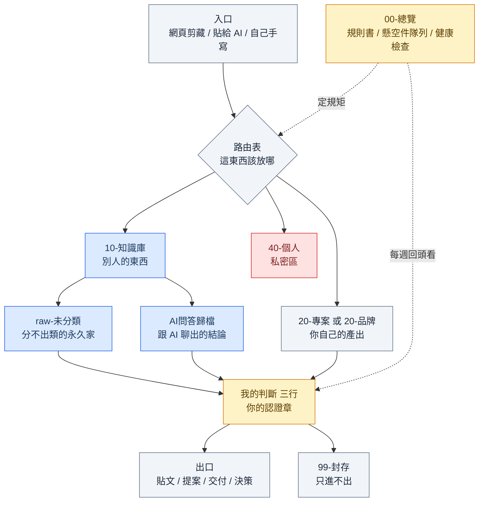

# 架構導覽：這套知識庫在幹嘛

> 動手之前先看完這頁，大概八分鐘。看完你會知道三件事：這套東西長什麼樣、為什麼這樣設計、哪些地方你可以改成自己的。
> 不想自己讀也行——把 `START.md` 貼進 Claude Code，它會先用十行講完這頁的重點再開始問你問題。

---

## 一、什麼是 vault、什麼是第二大腦

**vault 就是一個資料夾。** Obsidian 這個軟體打開一個資料夾，把裡面的 `.md` 純文字檔當筆記顯示，就這樣。沒有資料庫、沒有雲端帳號、沒有專有格式，你的東西永遠是一堆可以用記事本打開的文字檔。這件事很重要：軟體倒了你的筆記還在，換工具不用搬家，AI 也讀得懂。

**第二大腦是一個目標，不是一個功能。** 它想解決的問題只有一個——你看過的東西留不住。文章看完就忘、跟 AI 聊出好結論隔天想不起來、三個月前明明查過的資料要重查一次。第二大腦就是把這些東西放進一個「以後找得回來、而且找回來還看得懂」的地方。

**但光有資料夾不會變成第二大腦。** 多數人的筆記軟體最後都變垃圾場，原因是只做了「存進去」，沒做「存進去之後怎麼被找到、怎麼被用掉」。這一包補的就是後面那半：一套 AI 讀得懂的規則、一個固定的認證動作、一個每週二十分鐘的維護節奏。差別在於，你的筆記從此有一個讀者是 AI，而 AI 只有在你的庫裡放了「網路上查不到的東西」時才有用——那個東西就是你的判斷。

---

## 二、這套結構長什麼樣

顏色代表誰能動：

- **藍色 = AI 工作區**：AI 可以直接寫、直接改，不用問你。它的產出速度快，這區就是讓它跑的地方。
- **黃色 = 人把關區**：只有你能決定。AI 可以先擬一份草稿，但最後那句話要你點頭。
- **紅色 = 完全禁止**：AI 不讀、不寫、連算統計數字都跳過。
- **灰色 = 混合**：AI 可以新增，改既有的要先問。

每個部件解決什麼問題，一句話：

| 部件 | 它解決什麼問題 |
|---|---|
| `00-總覽/` | 規則寫在哪：AI 每次進來先讀這裡，不用你每次重講一遍背景 |
| `10-知識庫/` | 別人的東西堆在哪：剪報、方法論、SOP，跟你自己的產出分開放 |
| `10-知識庫/raw-未分類/` | 分類卡住時的逃生口：分不出來就丟這，不用當下硬猜（強迫分類是棄坑第一名原因） |
| `10-知識庫/AI問答歸檔/` | 跟 AI 聊出的結論不會被關掉：一個檔案四段話，下次直接翻 |
| `20-專案/`（或 `20-品牌/`） | 你自己的產出住哪：一個專案一個資料夾，寫東西時只翻這裡 |
| `40-個人/` | 有些事不該給 AI 看：一整區隔離，AI 有明文禁令 |
| `99-封存/` | 過時的東西不用刪：搬進去就不再干擾搜尋，但還找得回來 |
| `CLAUDE.md`（規則書） | AI 的行為說明書：放哪、補什麼欄位、哪裡不准碰，全在這一份 |
| 「我的判斷」三行 | 進庫門檻：沒有你的判斷，這個庫就只是網路資料的副本 |
| 懸空件隊列 | AI 不敢決定的事有地方排隊：不然它只會在聊天視窗講一聲，關掉就沒了 |
| 健康檢查三個數字 | 系統有沒有在爛：孤兒、缺來源、未認證，每週看一眼趨勢 |

---

## 三、我們的立場：AI 先存、人後裁決

這幾年 Obsidian 圈子最熱的討論是「筆記要不要交給 AI」。目前檯面上的主流答案是**分離式**：開兩個庫，主庫只放自己手寫的乾淨筆記，AI 在另一個亂庫工作；AI 產出的東西要用自己的話重寫一遍，才准進主庫。人先寫，AI 後編譯。

這一包走的是另一條：**一個庫，AI 先存，人後裁決。**

| | 分離式的做法 | 這一包的做法 |
|---|---|---|
| 庫的數量 | 兩個庫，物理隔離 | 一個庫，用資料夾與欄位標記區分，AI 有明訂的禁寫區 |
| 誰先動手 | 人先寫，AI 後編譯 | AI 先存，人後裁決 |
| 進主庫的門檻 | 用自己的話重寫全文 | 「我的判斷」三行 |
| 等人決定的事 | 沒有機制 | 懸空件隊列，當成一級物件管理 |
| 健康檢查 | 每週一份報告 | 縮成三個數字，自動任務算給你 |

**為什麼這樣選。** 分離式對「一個人的思想鏡子」是對的：庫乾不乾淨最重要，寧可少存也不要污染。但如果你的知識庫是拿來出東西的——寫貼文、做提案、交客戶、餵給 AI 當背景——那你需要的是吞吐量。手寫重寫的門檻會讓你每天只存得下兩三則，一個月後就放棄了。

**代價先講清楚，兩個。** 第一，三行判斷比重寫全文輕鬆，所以你很容易隨手亂填；填了跟想過了是兩回事，健康檢查裡的「未認證」數字就是用來抓這件事的。第二，AI 產出的速度一旦超過你裁決的速度，這個庫就不再代表你的判斷，會變成你跟 AI 的混合物——禁寫區跟隊列就是為了擋這個而存在。

**什麼時候你該選另一條路。** 你如果是純個人思考型的使用者，不做內容也不接案，庫的乾淨程度就是你的一切，那分離式做法對你更合適，這包你可以只拿走「規則書」跟「AI 問答歸檔」兩塊。

---

## 四、預設 vs 你可以改

下面每一列都是一個已經幫你決定好的預設值。**照預設走完全沒問題**，這些預設是從實際跑了一段時間的系統上拆下來的。但你如果有明確的理由要改，這張表告訴你改了會牽動什麼。

搭建過程中的訪談（`START.md` 第 1 步）就是在收集這張表的答案，AI 會照你的回答調整。

| # | 結構決定 | 預設值 | 可以改成什麼 | 改了會影響什麼 |
|---|---|---|---|---|
| 1 | 幾個區 | 五區：`00-總覽`、`10-知識庫`、`20-專案`、`40-個人`、`99-封存` | 有夥伴要共看 → 多開一區 `50-共用/`；完全不需要私密區 → `40-個人/` 可以先空著 | 多開一區，規則書的路由表、每週任務的掃描範圍都要跟著加一列。編號留空隙（00/10/20/40/99）就是為了讓你之後插得進去 |
| 2 | `20-` 這區叫什麼 | `20-專案/` | `20-品牌/`（你的輸出掛在對外的名字底下，像自媒體帳號、產品名、店名）、`20-客戶/`、`20-作品/` | 只是名字，但規則書、每週任務、健康檢查掃描範圍三個地方寫死了這個名稱，改名要同步改，不然 AI 會找不到路。搭建時 AI 會做一張對照表跟你確認 |
| 3 | 私密區的名字 | 固定 `40-個人/` | 建議別改。裡面裝個人隱私（健康、感情、薪水）或工作機密（合約、報價、未公開計畫）都行 | 名字不好聽是小事，換來的是規則書、每週任務、健康檢查三份檔案的路徑一致。真要改名，那三個地方要一起改，漏一處 AI 就會去讀不該讀的東西 |
| 4 | AI 對私密區的權限 | 完全禁止：不讀、不寫、連算統計數字都跳過 | 放寬成「可讀不可寫」（例如你想讓 AI 幫你分析自己的反思筆記） | 放寬之後，那區的內容有可能被 AI 拿去當素材、寫進對外輸出。要放寬的話，建議只放寬到某一個子資料夾，不要整區開放 |
| 5 | 主題索引頁 | 第一個月不建，全庫滿 30 篇才由每週任務提案 | 你如果本來就有幾百篇既有筆記，可以第一天就開 | 太早開會做出一堆空頁，然後每週對著空頁做維護，是這套系統最常見的爛尾點。晚開的代價是前一個月「孤兒」數字會等於總篇數，那是正常的 |
| 6 | 筆記的必填欄位 | 四欄：`title`、`date`、專案欄位、`entities`；外部素材另外強制 `source_url` | 想加 `status`、`type`、`priority` 之類的欄位 | 加欄位的成本在未來每一篇。加之前先問自己：三個月後我真的會用它做篩選嗎？答不出來就別加。少一個 `source_url` 的代價則是那篇剪報三個月後等於作廢 |
| 7 | 進庫門檻 | 「我的判斷」三行：為什麼留 / 下一步 / 相關 | 降到只填「為什麼留」一行；或反過來加嚴，要求用自己的話重寫摘要 | 這是整套系統的核心動作，也是唯一擋在「你的第二大腦」跟「網路資料副本」中間的東西。降門檻會讓存入量上去、庫的獨特性下去；加嚴則相反。如果「未認證」數字連續三週漲，那就是該降門檻的訊號 |
| 8 | AI 禁寫區與工作區 | 工作區（`raw-未分類`、`AI問答歸檔`）AI 直接寫；`20-` 區可新增不可改舊；`40-個人` 全禁 | 把某個專案資料夾也開放成 AI 工作區；或反過來，把 `10-知識庫` 全設成唯讀 | 放寬 = 吞吐量上升、你手寫的東西可能被 AI 改掉。收緊 = 每件事都要你點頭，很快會覺得煩。建議先照預設跑一個月再調 |
| 9 | 懸空件隊列 | 開，AI 遇到不敢決定的事一律排進來，你一週處理一次 | 不開，AI 直接在聊天視窗問你 | 不開的話，那些事會在你關掉視窗時消失，然後三週後以「怎麼會變成這樣」的形式回來找你。這是這包裡最不建議拿掉的一個部件 |
| 10 | 健康檢查 | 三個數字：孤兒、缺來源、未認證，每週算一次，只回報不清理 | 加數字（例如某個專案的篇數）；或改成每月算一次 | 數字加太多就沒人看了，三個是刻意壓到最少。改成每月的問題是，趨勢要三個點才看得出來，等於三個月才知道系統在爛 |
| 11 | 每週維護方式 | 手動貼：每週一打開 Claude Code，把任務範本整段貼進去，三到五分鐘 | 排程自動跑（Claude Code 有排程功能的話） | 手動的好處是你看得懂每週發生了什麼，第一個月很有價值。排程的風險是它默默跑，你不看報告，某天發現庫已經長歪三個月了 |
| 12 | `raw-未分類/` 的定位 | 永久的家：進去就不用再搬，靠搜尋跟標籤找得到 | 當成 inbox，規定每週清空 | 規定清空 = 每週多一件事要做，而且「必須分類」的壓力會回來。放著不管的代價是這區會越來越大，如果它超過全庫三成，代表你的分類規則跟實際工作對不上，該加一個新分區了 |

---

## 五、看完之後

三種走法，挑一種：

1. **照預設走**：直接把 `START.md` 貼進 Claude Code，回答五題訪談時全部寫「預設」，大概三十到五十分鐘蓋完。
2. **先客製再走**：把上表裡你想改的編號記下來（例如「2 我要叫品牌、7 我要降成一行」），貼 `START.md` 的時候一起告訴 AI，它會在訪談時對著這張表跟你確認。
3. **只拿零件**：你已經有自己的一套，那就挑規則書（`templates/CLAUDE.md.template`）、懸空件隊列、健康檢查三個數字這幾塊拿走，其他不用管。

不管走哪一種，第一天結束你會有一個能用的骨架加第一篇筆記。真正上手大概兩到三週，因為你得養成「順手丟給 AI 存」的習慣。
